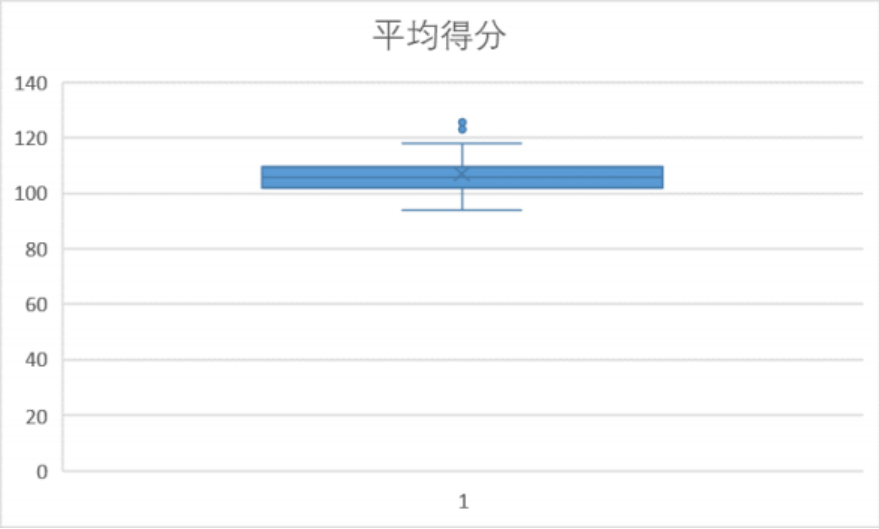

# 数据科学期末文档

#### 选题： 第二题  利用语言模型分析球赛文本转换为表格并进行数据分析

#### 作者： 何羽洵221900126

### 概要：项目旨在通过AI工具自动将球赛文本转换成结构化的表格数据，然后利用数据科学技术分析球队和球员的表现。项目包括两个阶段：文本转表格和数据分析。

# 阶段1：文本转表格

使用OpenAI的ChatGPT API进行文本到表格的转换。基于成本和数据质量的双重考虑，选取了大约100条数据进行总体分析，并专门选取了湖人队和勇士队的文本数据进行详细分析。为确保数据的精确性，进行了多次请求以获取最优质的转换结果。

### 实现情况描述

选择使用GPT 3.5的API来实现。由于API的使用需要收费，并且更关键的是由于tokens   限制，过多的数据会导致输出结果不理想，因此出于经济实力原因和最终表格效果考虑，本 次的文本转表格我们稍微削减了原定的总数据量，但是我们尽量保持我们的数据集的有效性 以及与我们分析角度的契合性：对于面向尽量多队伍的总体分析我们选用了100条左右的数 据，并且在挑选时尽量保证每条队伍至少出现过两次及以上来减少偶然因素造成的误差；对 于面向单条队伍的分析角度的对应数据，我们选取了著名的湖人队和勇士队作为研究对象， 选取的文本量大概各20-30条左右。

以下是具体的代码实现思路：（具体代码参见阶段一的main.py）

首先导入所需库，设置API密钥，读取输入文件。定义max_input_length为4096，计算 请求次数。接着定义多个提示（prompt），指导模型生成表格。初始化responses列表，
存储模型输出结果。遍历请求次数，向模型发送请求，分别截取输入文本，调用openai.Completion.create()发送请求。将模型输出结果追加至responses列表。最 后，将responses列表的内容合并，输出到文件。

### Prompt摘要

```bash
prompt_team  =   "请你基于以下内容，从球队的角度，以每个球队的名字、胜负、得分为titl e 。 "  \
"名字要写全称，胜负用W/L表示，得分要以己方得分-对方得分“ 的形式表示。"

\
"生成一个用逗号分割的表格。\n"

prompt_player  =   "请你基于以下内容，从球员的角度，以每个队员的名字、得分、篮板、助攻、 抢断、盖帽、受伤为title。涵盖尽可能多的队员。"  \
"名字要写英语全称，受伤要写明具体部位，在受伤这一栏如果没有就写无。"
\
"生成一个用逗号分割的表格。"  \
"除了表格内容以外，其他内容一律不要生成。\n"

prompt_player2  =   "请你基于以下内容，从球员的角度，以每个队员的名字、进球数为title。 涵盖尽可能多的队员。"  \
"名字要写英语全称。"  \
"生成一个用逗号分割的表格。"  \
"除了表格内容以外，其他内容一律不要生成。\n"

prompt_warriors  =  "请你基于以下内容，以出每场比赛The  Golden  State  Warriors的对  手名字、The  Golden  State  Warriors的总出手次数，The  Golden  State  Warriors的失误 次数，"  \
"The  Golden  State  Warriors的罚球次数，The  Golden  State  W arriors的总篮板数、The  Golden  State  Warriors的总得分为title ，"  \
"生成一个用逗号分割的表格。"  \
"其中对手名字请用英文全名，"  \
"除了表格内容以外，其他内容一律不要生成。"
prompt_team_warriors  =  "请你基于以下内容，从The  Golden  State  Warriors的角度， 以对手名字、总篮板数、总得分这三点为title 。"  \
"名字要写英语全称。"  \
"生成一个用逗号分割的表格。\n"
```

#### 表格描述

Lakers和warriros：以球员为单位，列出他们的得分、篮板、助攻、抢断、盖帽。其中 数据量分别为大约30条比赛。

team：以球队为单位，列出他们的输赢和比分。其中数据量大约为100条比赛。

warriros_goal：以勇士队的球员为单位，理出他们在每场比赛的进球数，其中数据量大 约为30条比赛。

warriros_team：以勇士队球队为单位，列出他们的对手、总出手次数、失误次数、罚球 次数、总进攻篮板数、总得分。其中数据量大约为30条比赛。

# 阶段2-1：针对多队伍总体分析

### 概述

本阶段旨在通过多队伍的数据分析队伍表现和队伍各项指标的关系以及队伍间的关系。

#### 分析角度1:  基础数据特征洞察（excel文件：分析一）

统计表格包含了如下原始内容：对于所有场次大于等于2的队伍统计其胜场、总场次数、每场具体得分。

Sheet1：计算了胜率并进行了胜率排名，可以直观地看到并比较我们的样本中不同队伍的取胜能力。
sheet2：计算了得分平均值并进行平均值排名，可以直观地看到并比较我们的样本中不同队伍的得分能力。
sheet3：计算了得分方差并计算变异系数，进行变异系数排名（注：这里计算的是样本方差，自由度是n-1），可以直观地看到并比较我们的样本中不同队伍的得分表现波动。
sheet4：绘制箱型图：所有队伍胜率、平均得分和变异系数，可视化地比较队伍与队伍之间整体的差距，初步掌握联赛整体概况。

我们选择这些数据进行整体分析的理由如下：

1. 胜率显然是一个队伍的强弱（至少是在我们选用的这100+条数据中）的最直接指标与表观度量，强队胜率高。我们平时看比赛预测比分也会经常选择查看队伍的历史胜负数。
2. 平均得分最直接直观地展现了一个队伍比赛表现程度，比赛表现强的队伍非常有可能得分也会高。
3. 变异系数是标准差除以平均值来平衡量纲，实际作用和方差相同，可以最直观直接地反映一条队伍的能力表现波动，通俗来讲就是 “队伍的表现是否稳定 ”。

具体的数值和排名这里不再赘述，详情参见文件，仅展示箱型图：




从图中我们可以看到：

1. 队伍的得分实际上非常接近，基本集中在100到110之间，这说明了在我们分析的这种运动竞技赛事中每一场的得分变化与不同场次的得分差距不会特别巨大，基本都会集中在这个区间并上下波动。
2. 队伍的胜率差距较大，哪怕是四分位距差距也已经到了夸张的0.4到1.0，说明头部强队和下游弱队的差距还是非常明显的。
3. 队伍的变异系数总体差距中等，主要集中分布在0.04到0.1，说明队伍的表现波动水平在队伍与队伍之间存在着一定的差距，即确实会存在有些队伍表现更稳定，另一些更不稳定，但是总体来说他们的表现波动水平差距不容易特别大。

#### 分析角度2：相关性分析（python）

为了使得相关性分析更加精确，这里将统计局数小于等于2的队伍全部去除，剩下19条队伍 将相关的数据放进csv文件当中。
首先，我们先绘制散点图，粗略观察一下数据的相关情况：   （代码参见： scatter.py）


通过观察我们可以粗略得到一些主观的感觉：对于胜率和平均得分，比较明显两者是有某种正相关关系的，但是由于胜率的上限是1所以平均得分在大约112分以上胜率就几乎都是1了。对于胜率和变异系数，主观上感觉非常凌乱，似乎没有明显的相关性。

接下来我们使用python代码进行如下计算：   （参见代码： pearsonr.py）

1. 计算胜率和平均得分的相关系数：
   可以看到相关系数高达0.69，考虑到胜率到达1.0之后停止增长，这个胜率和平均得 分的相关程度很显然在得分低于1.0胜率阈值时还要更高。
   因此我们可以得出结论：胜率和平均得分是有较强的线性正相关的，并且在得分达到约 112分以上时胜率达到最大值1，之后不能继续变大，不再变化。
2. 计算胜率和变异系数的相关系数：
   运行结果显示胜率和变异系数的相关系数只有-0.144，这实际上非常小，虽然样本容 量本身不大，但实际上也已经涵盖了近20条队伍（受赛事规模限制，本身参赛队伍数  量就难以很多），因此几乎可以认为胜率和变异系数没有关联。

这实际上是比较意外但也是情理之中的，意料之外在于我们平时可能会认为 “稳 ”的队伍可能更容易取胜，但是细想之后发现这完全在情理之中：首先稳定弱的队伍也是稳定的，其次每一场的得分其实和对手的关系也很大，一条百战百胜的强队在遇到弱队也会得分变多，遇到较强的队伍也会得分变少，但是很有可能这条强队可以都取得胜利，然而得分有较大差距。

综上所述，以胜率和变异系数为指标来讲，我们认为队伍的取胜表现和发挥稳定性的相关性在统计学上不显著。


#### 分析角度3：独立性检验（python）

代码实现了在显著性水平0.05时进行如下检验：    （参见文件x2contingency.py）

1. 进行胜率和平均得分的卡方独立性检验
2. 进行胜率和变异系数的卡方独立性检验

运行结果如下所示：


可以看到根据分析，可以认为在统计学上胜率和平均得分、胜率和变异系数都是独立的。变异系数与胜率独立通过前面的散点图不难看出结论的合理性，但是胜率和平均得分的独立让我们有一些意外。
再次观察数据特征可以发现，数据的数量级差距巨大，变异系数的数量级约在10^(-2)到10^(-3) ，胜率在10^(-1)，而平均得分却在10^2 ，很有可能是由于数据范围差距过大导致容易呈现独 立性。因此我们进行了下面的分析角度4。

#### 分析角度4：归一化的独立性检验（python）

总体思路和功能类似分析角度3，区别是在检验之前引入了数据归一化操作(归一化后乘10，同时为了避免出现内联表0值的错误对所有值+1)，以冀获得更加准确的结论。归一化可以保留数据的相对顺序和比例关系，同时消除不同数据范围的影响，使得它们更具可比性。通过将数据映射到相同的尺度，可以更准确地进行独立性检验。
代码运行结果如下：   （参见代码： x2pro.py）


可以看到数据依旧显著独立。
综上所述，我们可以得出结论：在统计学上胜率和平均得分以及胜率和变异系数的独立性是显著的。

# 阶段2-2：针对特定队伍分析

### 概述

在这一阶段，我们专门获取了勇士队和湖人队的数据对队内各个球员表现与总体表现进行分析，希望获得球员的具体表现差异与球员和球队表现的关系。

#### 分析角度1：聚类分析球员特征（WolframMathematica）

在这一角度中我选择使用wolfram  mathematica工具来读取csv文件中湖人队所有球员的得分、篮板和助攻数据并进行聚类分析，以此来识别不同风格特点的球员类别。

具体的运行结果如下所示：（参见 湖人聚类分析.wls）


结果分析：  可以看到自动的聚类识别结果将数据分为了三类，简单观察并分析就可以发现：
   第一类：全能型选手，各项数据均有不俗表现，得分能力更是犹为突出，是队内的核心人物，可攻可辅；

   第二类：得分型选手，在 “得分 ”一项特别突出，其他两项相较之下偏弱，是风格显著的人气选手，或者一些辅助能力较弱的正常选手；

   第三类：边缘型全能选手，各项指标均有但不突出，得分偏低，总体水平从样本统计到的数字上看实力偏弱。

#### 分析角度2: 单变量回归分析球队进攻效率与比赛胜负的相关关系  ( Regression Analysis )

在这一角度中选择使用python工具来分析勇士队的多场比赛数据。（见回归分析 .xlsx） 笔者选择采取量化球队进攻效率的方式， 运用回归分析和显著性检验的方法， 来探究进攻效率和比赛胜负的关系。

*注意到比赛的胜负情况（因变量Y） 只有取值【胜： 1， 负： 0】，笔者最后弃用线性回归而选择逻辑回归的结果，因此此处不再展示线性回归的详细过程（详情见线性回归.py 逻辑回归.py）

```py
import pandas as pd
import numpy as np
import statsmodels.api as sm
import matplotlib.pyplot as plt

# 创建比赛数据的DataFrame
data = {
    '对手': ['Houston Rockets', 'Milwaukee Bucks', 'Orlando Magic', 'Charlotte Hornets',
            'Portland Trail Blazers', 'Brooklyn Nets', 'Portland Trail Blazers',
            'Los Angeles Lakers', 'Minnesota Timberwolves', 'Detroit Pistons',
            'Atlanta Hawks', 'Utah Jazz', 'Detroit Pistons'],
    '总出手次数': [37, 24, 17, 13, 11, 108, 120, 109, 125, 115, 88, 86, 84],
    '失误次数': [14, 10, 9, 8, 7, 15, 17, 18, 25, 30, 13, 11, 14],
    '罚球次数': [8, 10, 7, 9, 9, 19, 19, 15, 14, 11, 18, 18, 22],
    '总进攻篮板数': [48, 52, 46, 42, 37, 46, 44, 42, 39, 37, 41, 51, 37],
    '总得分': [115, 121, 113, 111, 108, 119, 108, 85, 101, 102, 106, 103, 102],
    '胜负': ['负', '负', '胜', '胜', '胜', '胜', '负', '负', '胜', '负', '胜', '负', '负']
}
df = pd.DataFrame(data)

# 计算进攻效率
df['进攻效率'] = df['总得分'] / (df['总出手次数'] - df['总进攻篮板数'] + df['失误次数'] + df['罚球次数'])

# 将胜负转换为二进制值（1代表胜利，0代表失败）
df['胜负'] = df['胜负'].apply(lambda x: 1 if x == '胜' else 0)

# 使用逻辑回归分析进攻效率对胜负的影响
X = df['进攻效率']  # 自变量：进攻效率
Y = df['胜负']     # 因变量：胜负

# 添加截距项
X = sm.add_constant(X)

# 拟合逻辑回归模型
model = sm.Logit(Y, X)
results = model.fit()

# 输出回归结果
print(results.summary())

# 绘制逻辑回归拟合曲线和散点图
plt.scatter(df['进攻效率'], df['胜负'], label='Actual Data')

# 生成逻辑回归拟合曲线的预测值
x_vals = np.linspace(df['进攻效率'].min(), df['进攻效率'].max(), 100)
x_vals = sm.add_constant(x_vals)
y_vals = results.predict(x_vals)

# 绘制逻辑回归拟合曲线
plt.plot(x_vals[:, 1], y_vals, color='red', label='Logistic Regression Fit')
plt.xlabel('进攻效率')
plt.ylabel('胜负')
plt.title('进攻效率对比赛胜负的关系')
plt.legend()
plt.show()

# 显著性检验
p_values = results.pvalues[1:]  # 忽略截距项
alpha = 0.05  # 显著性水平

# 根据显著性水平判断自变量的显著性
significant_vars = [var for var, p_value in p_values.items() if p_value < alpha]

# 输出显著的自变量
print("显著的自变量：", significant_vars)
```

步骤：
    1.量化进攻效率 2.拟合回归模型 3.进行显著性检验 4.运行结果：


从结果上，回归曲线效果并不算十分理想，考虑到是由于数据量有限所致。但仍旧在0.05的 显著性水平上可以看出球队进攻效率与比赛胜负存在一定的负相关性。
由此我们可以得出结论：球队的进攻效率的提升不会显著提高获胜几率，甚至有可能适得其反，实际比赛时，要有效地平衡作战风格，避免过于谨慎和突进两个极端，形成稳中有健的作战风格。

#### 分析角度3: 多变量线性回归分析不同因素与比赛胜负的相关关系  ( Regression Analysis )

在分析角度2的基础上，独立考虑每个因素（出手次数，失误次数，罚球次数，进攻篮板数）

对比赛胜负的影响，构建多元线性回归模型。（多元回归.py）

```py
import pandas as pd
import statsmodels.api as sm
import matplotlib.pyplot as plt
import seaborn as sns

# 创建数据框
data = pd.DataFrame({
    '总出手次数': [37, 24, 17, 13, 11, 108, 120, 109, 125, 115, 88, 86, 84],
    '失误次数': [14, 10, 9, 8, 7, 15, 17, 18, 25, 30, 13, 11, 14],
    '罚球次数': [8, 10, 7, 9, 9, 19, 19, 15, 14, 11, 18, 18, 22],
    '总进攻篮板数': [48, 52, 46, 42, 37, 46, 44, 42, 39, 37, 41, 51, 37],
    '总得分': [115, 121, 113, 111, 108, 119, 108, 85, 101, 102, 106, 103, 102],
    '胜负': [0, 0, 1, 1, 1, 1, 0, 0, 1, 0, 1, 0, 0]
})

# 添加截距项
data = sm.add_constant(data)

# 拟合多元线性回归模型
model = sm.OLS(data['胜负'], data[['const', '总出手次数', '失误次数', '罚球次数', '总进攻篮板数', '总得分']])
results = model.fit()

# 打印回归结果
print(results.summary())

# 绘制每个变量的回归曲线
sns.pairplot(data, x_vars=['总出手次数', '失误次数', '罚球次数', '总进攻篮板数', '总得分'], y_vars='胜负', kind='reg')
plt.show()
```

运行结果：


从结果上看，失误次数和罚球次数与比赛获胜呈明显的负相关性，同时比较出乎笔者预设的是，总出手次数和进攻篮板数也与比赛获胜呈负相关性（或非正相关性）。
我们可以得出结论：在团队比赛时应当重视培养合作能力、改进进攻策略，减少因贸然行动带来的失误。

#### 分析角度4： 主成分分析寻找核心球员( PCA )

以勇士队为例，在这一角度中，笔者期望以PCA实现数据降维的方式来寻找队伍中的核心成员。（从20人中筛选4~5人）

首先，我们通过对球员多维度的表现：得分，篮板，助攻，盖帽，抢断（数据集：warriors.xlsx） 构建雷达图（球员雷达图.py）来对球员在比赛中的表现能力建立一个直观的感受。


对原始特征矩阵作简要处理（加权化，归一化）后进行主成分分析：

```py
import numpy as np
from matplotlib import pyplot as plt
from sklearn.decomposition import PCA

# 构建特征矩阵
data = np.array([
    [29, 4, 5, 0, 0],[25, 1, 9, 3, 0],[10, 10, 0, 0, 0],[9, 11, 6, 0, 2],
    [13, 2, 4, 0, 0],[12, 2, 2, 0, 0],[10, 7, 2, 0, 0],[13, 4, 0, 0, 0],
    [23, 16, 6, 0, 5],[18, 3, 3, 0, 0],[16, 2, 6, 0, 0],[30, 3, 1, 0, 0],
    [24, 17, 4, 0, 4],[12, 10, 4, 0, 3],[18, 6, 0, 0, 0],[13, 2, 0, 0, 0],
    [33, 4, 5, 0, 0],[15, 12, 4, 0, 2],[16, 4, 4, 1, 0],[15, 2, 2, 0, 0]
])

# 定义权重
weights = np.array([0.4, 0.2, 0.2, 0.1, 0.1])

# 加权处理
weighted_data = data * weights

# 标准化加权后的数据
weighted_data_std = (weighted_data - np.mean(weighted_data, axis=0)) / np.std(weighted_data, axis=0)

# 创建PCA对象，指定要保留的主成分个数为2
pca = PCA(n_components=2)

# 进行PCA降维
pca_data = pca.fit_transform(weighted_data_std)

# 计算每个球员的降维后特征向量与坐标原点之间的欧氏距离
distances = np.linalg.norm(pca_data, axis=1)

# 选取距离最近的前5个球员作为核心球员
core_players_indices = np.argsort(distances)[:5]

# 输出核心球员的索引和距离
for i in core_players_indices:
    print(f"Player {i+1}: Distance = {distances[i]}")

# 绘制降维后的数据散点图
plt.scatter(pca_data[:, 0], pca_data[:, 1])
plt.xlabel('PC1')
plt.ylabel('PC2')
plt.title('PCA Visualization')
plt.show()
```

运行结果：


从结果上看，最后被PCA筛选出的核心队员为1,5,10,11,12号。与雷达图直观上指示的出色队员基本相符。我们可以得出结论：通过PCA降维，可以根据实际情况的不同采用不同的加权方式，从而筛选出在不同方向上（进攻，辅助，反制等）表现出色的队员。
